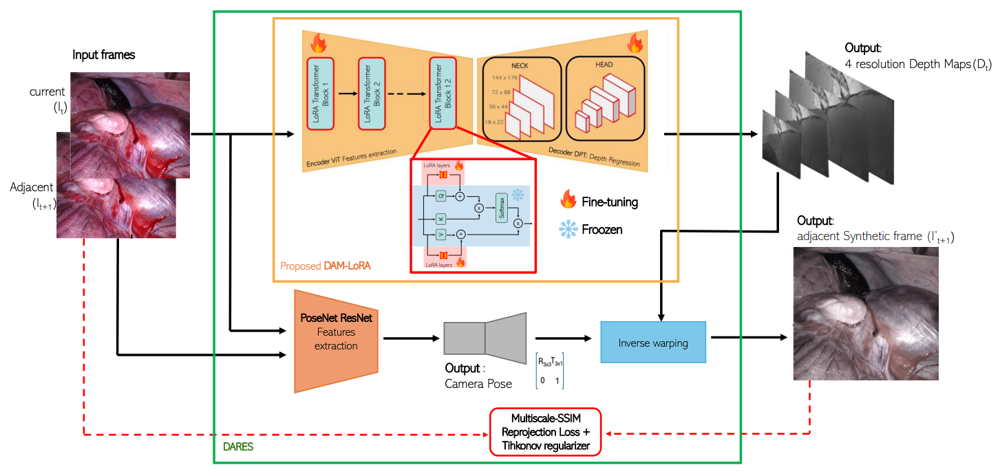
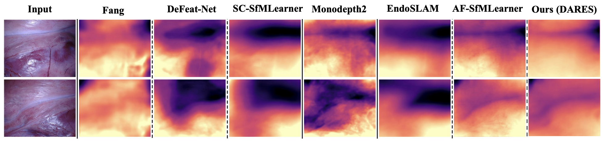
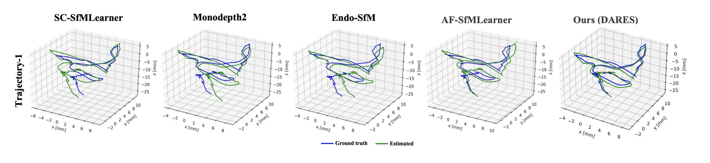
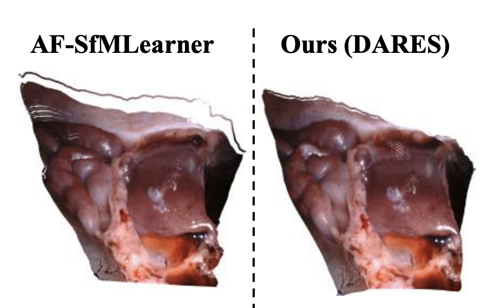

# DARES

This is the official PyTorch implementation for training and testing depth estimation models using the method described in

> **DARES: Depth Anything in Robotic Endoscopic Surgery with Self-supervised Vector-LoRA of the Foundation Model**
>
> Mona Sheikh Zeinoddin, Chiara Lena, Jiongqi Qu, Luca Carlini, Mattia
Magro, Seunghoi Kim,  Elena De Momi,  Sophia Bano, Matthew
Grech-Sollars, Evangelos Mazomenos,  Daniel C. Alexander, Danail
Stoyanov, Matthew J. Clarkson and Mobarakol Islam 
>
> [accepted by the European Conference on Computer Vision 2024 Efficient Deep Learning for Foundation Models WorkShop (arXiv pdf)](https://arxiv.org/pdf/2408.17433)


#### Overview

<p align="center">
 
</p>

## ✏️ 📄 Citation

If you find our work useful in your research please consider citing our paper:

```
@article{zeinoddin2024dares,
  title={DARES: Depth Anything in Robotic Endoscopic Surgery with Self-supervised Vector-LoRA of the Foundation Model},
  author={Zeinoddin, Mona Sheikh and Lena, Chiara and Qu, Jiongqi and Carlini, Luca and Magro, Mattia and Kim, Seunghoi and De Momi, Elena and Bano, Sophia and Grech-Sollars, Matthew and Mazomenos, Evangelos and others},
  journal={arXiv preprint arXiv:2408.17433},
  year={2024}
}
```


## ⚙️ Setup

We ran our experiments with PyTorch 1.2.0, torchvision 0.4.0, CUDA 10.2, Python 3.7.3 and Ubuntu 18.04.


## 🖼️ Prediction for a single image or a folder of images

You can predict scaled disparity for a single image or a folder of images with:

```shell
CUDA_VISIBLE_DEVICES=0 python test_simple.py --model_path <your_model_path> --image_path <your_image_or_folder_path>
```


## 💾 Datasets

You can download the [Endovis or SCARED dataset](https://endovissub2019-scared.grand-challenge.org) by signing the challenge rules and emailing them to max.allan@intusurg.com, the [EndoSLAM dataset](https://data.mendeley.com/datasets/cd2rtzm23r/1), the [SERV-CT dataset](https://www.ucl.ac.uk/interventional-surgical-sciences/serv-ct), and the [Hamlyn dataset](http://hamlyn.doc.ic.ac.uk/vision/).

**Endovis split**

The train/test/validation split for Endovis dataset used in our works is defined in the `splits/endovis` folder. 

**Endovis data preprocessing**

We use the ffmpeg to convert the RGB.mp4 into images.png:

```shell
find . -name "*.mp4" -print0 | xargs -0 -I {} sh -c 'output_dir=$(dirname "$1"); ffmpeg -i "$1" "$output_dir/%10d.png"' _ {}
```
We only use the left frames in our experiments and please refer to extract_left_frames.py. For dataset 8 and 9, we rephrase keyframes 0-4 as keyframes 1-5.

**Data structure**

The directory of dataset structure is shown as follows:

```
/path/to/endovis_data/
  dataset1/
    keyframe1/
      image_02/
        data/
          0000000001.png
```


## ⏳ Endovis training

**Stage-wise fashion:**

Stage one:

```shell
CUDA_VISIBLE_DEVICES=0 python train_stage_one.py --data_path <your_data_path> --log_dir <path_to_save_model (optical flow)>
```

Stage two:

```shell
CUDA_VISIBLE_DEVICES=0 python train_stage_two.py --data_path <your_data_path> --log_dir <path_to_save_model (depth, pose, appearance flow, optical flow)> --load_weights_folder <path_to_the_trained_optical_flow_model_in_stage_one>
```

**End-to-end fashion:**

```shell
CUDA_VISIBLE_DEVICES=0 python train_end_to_end.py --data_path <your_data_path> --log_dir <path_to_save_model (depth, pose, appearance flow, optical flow)>
```


## 📊 Endovis evaluation

To prepare the ground truth depth maps run:
```shell
CUDA_VISIBLE_DEVICES=0 python export_gt_depth.py --data_path endovis_data --split endovis
```
...assuming that you have placed the endovis dataset in the default location of `./endovis_data/`.

The following example command evaluates the epoch 19 weights of a model named `mono_model`:
```shell
CUDA_VISIBLE_DEVICES=0 python evaluate_depth.py --data_path <your_data_path> --load_weights_folder ~/mono_model/mdp/models/weights_19 --eval_mono
```
#### Appearance Flow

<p align="center">
 
</p>

#### Depth Estimation

<p align="center">
 
</p>

#### Visual Odometry

<p align="center">
 
</p>

#### 3D Reconstruction

<p align="center">
 
</p>


## 📦 Model zoo

| Model        | Abs Rel | Sq Rel | RMSE | RMSE log | Link |
| ------------ | ---------- | ------ | --------- | ---- | ---- |
| Stage-wise (ID 5 in Table 8) | 0.059 | 0.435 | 4.925 | 0.082 |[baidu](https://pan.baidu.com/s/1MT5RrbDl8Wh6otPihD0kEw) (code:n6lh); [google](https://drive.google.com/file/d/14VFlTHq6raQkdyCRBCQYV-mbFO4eOM5b/view?usp=sharing)|
| End-to-end (ID 3 in Table 8) | 0.059 | 0.470 | 5.062 | 0.083 |[baidu](https://pan.baidu.com/s/1JrcMBU0wKCbgEdiF2kzQ6A) (code:z4mo); [google](https://drive.google.com/file/d/1kf7LjQ6a2ACKr6nX5Uyee3of3bXn1xWB/view?usp=sharing)|
| ICRA  | 0.063 | 0.489 | 5.185 | 0.086 |[baidu](https://pan.baidu.com/s/11SogWGI7C7kUGTkABPTMOA) (code:wbm8); [google](https://drive.google.com/file/d/1klpUlkYtXZiRsjY6SdRHvNAKDoYc-zgo/view?usp=sharing)|

## Important Note

If you use the latest PyTorch version,

Note1: please try to add 'align_corners=True' to 'F.interpolate' and 'F.grid_sample' when you train the network, to get a good camera trajectory.

Note2: please revise color_aug=transforms.ColorJitter.get_params(self.brightness,self.contrast,self.saturation,self.hue) to color_aug=transforms.ColorJitter(self.brightness,self.contrast,self.saturation,self.hue).


## Contact

If you have any questions, please feel free to contact mona.zeinoddin.22@ucl.ac.uk.


## Acknowledgement

Our code is based on the implementation of [AF-Sfm Learner](https://github.com/ShuweiShao/AF-SfMLearner). We AF-Sfm Learner's authors for their excellent work and repository.
